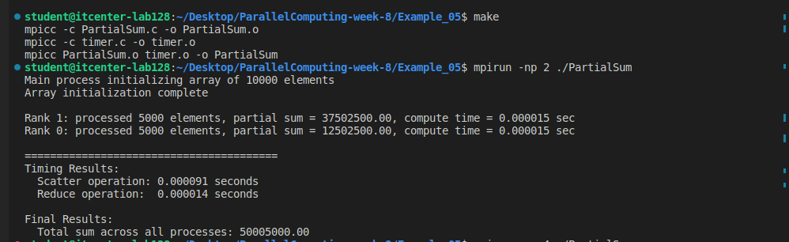
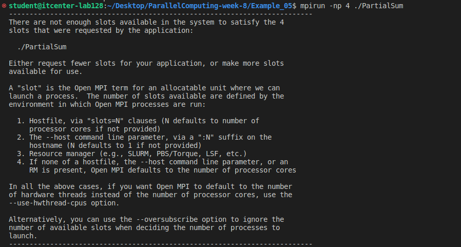
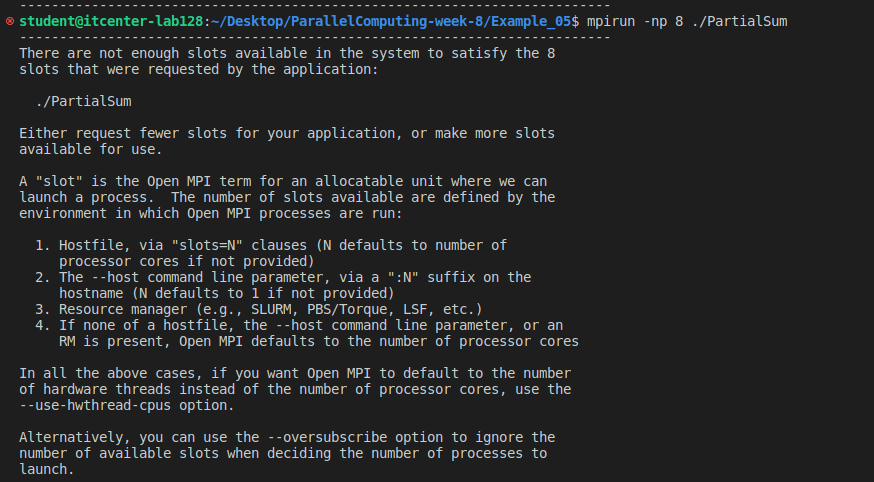

# MPI Collective Communication – Example 05

This is the solution for the Week 8 MPI lab.  
The goal of this assignment was to split work between MPI processes using collective communication calls, calculate local partial sums, and then combine everything into one final sum using a reduction. Timing for the scatter and reduce operations was also measured.

The code that I filled in is located in `PartialSum.c`, and I used the `timer.c` file that was already provided.

---

## 📌 What the program does

1. **Rank 0 (main process)** creates an array with 10,000 elements and initializes it.
2. Each MPI process gets a **different sized chunk** of the array, because sometimes the array does not divide evenly.
3. We use **MPI_Allgather** so every process knows how many elements each rank will get.
4. Using **MPI_Scatterv**, the array is split and sent to all processes.
5. Each process calculates a **local partial sum** of its own chunk.
6. We use **MPI_Reduce** with the `MPI_SUM` operator to add all the partial sums together into one final result on rank 0.
7. We measure:
   - Scatter time  
   - Reduce time  
   - Compute time per process

---

## 📌 Explanation of the MPI functions used

### **MPI_Allgather**
We needed this to collect each process's `nsize` (how many elements they get).  
This helps build the `nsizes[]` and `offsets[]` arrays which Scatterv requires.  
Allgather makes sure **every rank has this information**, not only the main process.

### **MPI_Scatterv**
This is like `MPI_Scatter`, but it supports **different counts per process**.  
- `nsizes[]` tells MPI how many elements each rank gets  
- `offsets[]` tells MPI where in the global array each chunk starts

This allows load balancing when the data size is not perfectly divisible.

### **MPI_Reduce**
This combines values from all processes into one result.  
We used:

```c
MPI_Reduce(&local_sum, &total_sum, 1, MPI_DOUBLE, MPI_SUM, 0, comm);

So rank 0 receives the final sum of all local sums.
📌 Why only rank 0 frees the global array

Only rank 0 actually allocates the a_global array (the full 10,000 elements).
All other ranks have a_global = NULL, so they must not deallocate it.
Every rank deallocates only its own a_local array.
📌 Compilation

I used the provided Makefile:

make clean
make

This compiles:

    PartialSum.c

    timer.c
    and links them into the executable PartialSum.

📌 Running the program
2 processes:

mpirun -np 2 ./PartialSum

4 processes:

mpirun  -np 4 ./PartialSum

8 processes:

mpirun -np 8 ./PartialSum

📸 Screenshots / Results
2 processes



Final sum: 50005000.00
4 processes


8 processes


📌 Thoughts / Conclusion

The results show that the sum is correct no matter how many processes we run.
Using Scatterv made it easy to give each process the right amount of work.
Reduce combined the partial sums reliably.
The scatter and reduce times get a bit slower when oversubscribing (which was expected because the computer has only 2 cores), but the program still runs correctly.

Overall this lab helped me understand how collective communication works in MPI, especially when splitting uneven workloads.