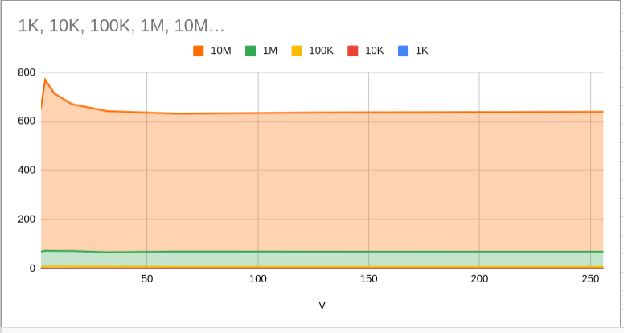

---

### About
This lab was about testing how **data layout in memory** affects performance.  
I used the **AoSoA (Array of Structures of Arrays)** layout and measured how different vector widths (`V`) change execution time when initializing large arrays.

The main idea: CPUs love contiguous data because of how caching works. So we check how much faster (or slower) things get when memory is grouped differently.

---

### How I Did It
- Edited `aosoa_measurement.cpp` to fill in the missing parts.
- Used the provided `Makefile` to test several vector sizes: `2, 4, 8, 16, 32, 64, 128, 256`.
- Ran tests for different array lengths (`N = 1K, 10K, 100K, 1M, 10M`).
- Each test wrote the results into a `.csv`.
- Copied results into Google Sheets to plot a graph.

Example:
make test_1M

graph:

https://docs.google.com/spreadsheets/d/1HzGy9LAmChMWUqOAWzYw_QvmhDey9uq1LOMFxprcK7Y/edit?usp=sharing

