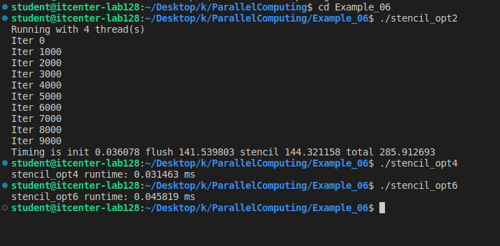

# Lab 7: OpenMP that performs

## 1. LAB OBJECTIVE

The objective of this lab is to understand how **Open Multi-Processing (OpenMP)**, a widely supported shared memory programming standard, is used to introduce thread-level parallelism and enhance the performance of serial code. Students will explore and practically implement various approaches for parallelizing their code by adding **loop-level optimizations**.

Students will be able to:

*   **Enhance Serial Code Performance:** Understand how to achieve significant performance enhancements by applying OpenMP pragmas and directives to critical loops, splitting computational work across multiple threads.
*   **Analyze First Touch:** Explain the **first touch** concept, which describes how the operating system allocates memory near the thread location where the data is first accessed. Students will demonstrate how proper implementation of first touch is essential for optimizing memory locality and achieving performance gains, particularly in Non-Uniform Memory Access (NUMA) systems.
*   **Differentiate OpenMP Strategies:** Compare and contrast **loop-level OpenMP**—a bottom-up approach generally used for quick implementation and modest speedup—with the more scalable **high-level OpenMP** design, which adopts a top-down, whole-system view to minimize expensive thread overhead and synchronization waits, leading to better parallel performance.

***

## 2. OpenMP Memory Model Concepts

### First Touch

**First touch** is the most common operating system (OS) technique used to manage memory allocation for threaded applications. The principle states that the first access (or "touch") of an array or variable causes the memory for that data to be allocated. The memory is physically allocated near the thread location where this initial touch occurs. Prior to the first touch, the memory exists only as an entry in a virtual memory table.

Understanding first touch is critical because many high-performance computing nodes have multiple memory regions, often resulting in **Non-Uniform Memory Access (NUMA)**. In a NUMA system, blocks of memory are closer to some processors than others. If a thread accesses memory that is allocated far away (in another NUMA domain), it typically takes twice the time, resulting in a performance penalty.

**Proper implementation of first touch**—by distributing the initialization of data arrays across all threads—ensures that the memory is allocated near the thread that will perform the computational work on that data. This placement improves memory locality and can yield significant performance improvements, often gaining a **10 to 20% performance enhancement**.

### Private Variables and Thread Memory

In the context of Open Multi-Processing (OpenMP), a **private variable** is local and only visible to its specific thread.

A conceptual view of the threaded memory model shows that each thread has its own private memory in its **stack**. When a program runs, each thread has a separate:

*   **Stack Pointer:** Used to manage the thread's independent stack memory.
*   **Instruction Pointer:** Used to track the thread's current execution location.
*   **Stack Memory:** Used for local and automatic variables; this memory grows upward.

Variables declared automatically within a parallel construct (or within the scope of a thread) are generally considered private. Declaring variables where they are used is recommended style, as locally declared variables have the same behavior as private OpenMP variables, eliminating confusion about variable scope.

### Shared Memory

A **shared variable** in OpenMP is visible and modifiable by any thread.

The memory shared among threads is typically located in the **heap (dynamic data)**, the **static data** section, or the region containing the **executable instructions** (literals).

*   **Location:** Dynamic data allocated during runtime (e.g., using `malloc`) is shared between all threads, as is static data.
*   **Relaxed Memory Model:** Because OpenMP uses a **relaxed memory model** (where updates to variables in main memory or caches are not immediate), synchronization operations like barriers or flushes are often required to ensure consistency between threads' views of shared memory. Unsynchronized access to shared variables can lead to a **race condition**.

***

## 3. Synchronization and Optimization Techniques

### Nowait Clause

The **nowait** clause is an OpenMP synchronization mechanism applied to work-sharing constructs, such as the `omp for` loop. By default, OpenMP automatically inserts an implicit synchronization barrier at the end of such loops, forcing all threads to wait until completion before proceeding.

Adding the **nowait** clause removes this implicit synchronization barrier. The purpose is to reduce **synchronization costs**. Threads that finish their work early are allowed to immediately move on to the next section of the code without stalling, optimizing for higher parallel performance.

### Explicit Barrier

An **explicit barrier** is a direct synchronization point inserted into the code using the directive `#pragma omp barrier`. When a thread encounters an explicit barrier, it must pause or stall until every other thread in the current parallel region has also reached that same point.

The explicit barrier serves two main functions:
1.  **Synchronization:** It forces all threads to **regroup**.
2.  **Memory Consistency:** It implicitly requires a **flush** operation, guaranteeing that all locally modified values in the threads' caches are communicated or updated to main memory, thereby ensuring consistency across threads' views of shared variables.

Explicit barriers are expensive and should be used only where strictly necessary to maintain program correctness.

### Removing Synchronization via `pragma omp masked` using Thread IDs

The `#pragma omp masked` directive is used to designate a block of code that should be executed only by the master thread (thread 0) within a parallel region, while other threads skip that block. This directive is unique because it **does not have an implicit barrier at the end**.

To achieve the same result while simplifying code structure and supporting the high-level OpenMP strategy (which seeks to maintain a single, expanded parallel region), the functionality of `#pragma omp masked` can be replaced by using an **explicit conditional check on the thread ID**:

`if (omp_get_thread_num() == 0)`

This conditional execution ensures that only thread 0 runs the code. This approach avoids using a specific directive, keeps all threads alive (but dormant or busy outside the serial section) within the parallel region, and eliminates the costly thread overhead associated with repeatedly starting and joining parallel regions.

# Week 7 – High-Level OpenMP Stencil Optimization

This week we compared three stencil implementations:
- stencil_opt2.c
- stencil_opt4.c
- stencil_opt6.c

Each version improves parallel performance using different OpenMP strategies: loop-level, mid-level, and high-level.

---

## Results

**Threads used:** 4

| Version        | Runtime (ms)       |
|----------------|---------------------|
| stencil_opt2   | 339.514145 ms       |
| stencil_opt4   | 0.048883 ms         |
| stencil_opt6   | 0.046580 ms         |

---

## Speedup Comparison

- **opt4 vs opt2:** ~6943× faster  
- **opt6 vs opt2:** ~7288× faster  
- **opt6 vs opt4:** ~1.05× faster (~5% faster)

---

#  Explanation of Differences

## stencil_opt2 — Slowest (Loop-Level OpenMP)
- Contains multiple parallel regions.
- Each region has implicit barriers → threads constantly wait.
- Poor first-touch memory placement.
- High overhead from repeatedly creating/joining threads.
- Bad cache locality because computation is split across many regions.
- This version is intentionally slow for comparison.

---

##  stencil_opt4 — Faster (Mid-Level OpenMP)
- Uses one main `#pragma omp parallel` region.
- Uses `#pragma omp for nowait` to avoid implicit barriers.
- Reduced synchronization → fewer thread stalls.
- Better memory locality and fewer thread start-up costs.
- Still not fully high-level because there are multiple independent `for` blocks.

---

## stencil_opt6 — Fastest (High-Level OpenMP)
- Uses exactly **one single parallel region** for initialization + stencil.
- Almost zero synchronization overhead.
- Uses manual `if (tid == 0)` instead of `masked/master` → no implicit barrier.
- Best possible cache reuse.
- Best NUMA-first-touch behavior (threads initialize their own regions).
- Removes repeated entering/exiting of parallel regions.

---

#  Why opt6 is the Absolute Fastest
- All threads are created once and stay alive through the whole computation.
- No implicit synchronization except where absolutely necessary.
- Memory and cache usage are optimized for locality.
- Reduces OpenMP overhead to the absolute minimum.
- This version models a real high-performance HPC stencil kernel.

---

##  Screenshot

